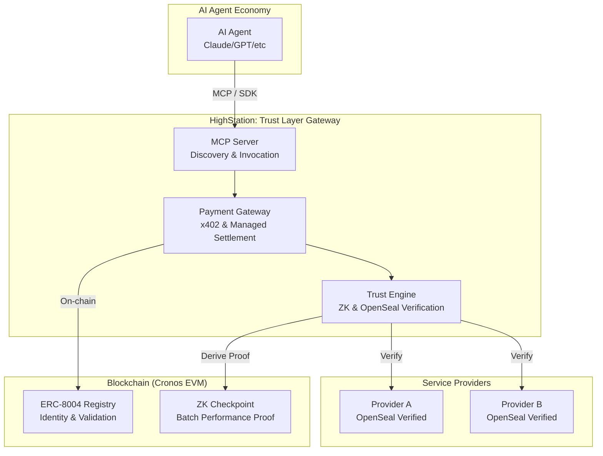

# HighStation 🚀

**The Trust Layer for AI Agents: ZK & OpenSeal-Powered Infrastructure API Gateway**

[🇰🇷 한국어 버전](./README_KR.md) | 🌐 [Website](https://highstation.net)

**"A invisible API server—on what basis do you trust it?"**

HighStation mathematically verifies the integrity of source code via **OpenSeal**, ensuring a **'Trustworthy API Service'** regardless of the provider. 
Verified providers can rightfully demand **CRO** payments based on the **x402** protocol as compensation for proving their transparency. HighStation is the AI infrastructure that mediates these trust-based autonomous transactions.

---

## 🎥 Demo

*(Demo Video Placeholder)*

---

## 💡 Why HighStation? (Value Proposition)

For the AI agent economy to thrive, we need an environment where "APIs of unknown origin" can be used with confidence.

- **🤖 AI Agents**: "Trust mathematical proof instead of vague reputation." Access only verified services where performance manipulation is impossible via ZK and OpenSeal.
- **🛠️ Service Providers**: "Prepare your API without worrying about payment systems." Monetize immediately without complex on-chain payment implementation via x402 standards and managed wallets.
- **🌐 Ecosystem**: Compliance with the ERC-8004 standard ensures that identities, reputations, and verification results of agents and services are managed in an interoperable form on the blockchain.

---

## 🛠️ Key Features (Hackathon Version)

HighStation provides the following core features for autonomous agent 'Trust':

1.  **Custom Domain Support**: Use your own domain (Cloudflare-style integration)
2.  **OpenSeal Protocol (L1 Code Integrity)**: Guarantees 'Execution Integrity' by verifying that the running code matches the public source via Merkle Roots.
3.  **Performance Monitoring**: Automatically collects and monitors performance metrics such as latency and success rate.
4.  **x402 (Standardized Payment)**: Ultra-low latency, CRO-based payment interface between AI agents and service providers.
5.  **MCP Server**: A standard interface for AI agents to automatically discover and utilize services.

---

## 🏗️ Architecture

---

## 📚 Use & Guides (Public Guides)

Refer to the following documents for detailed guides on starting and verifying HighStation:

### 👤 Public Service Guides
- **[Vision & Goals](docs/public/VISION_KR.md)**: HighStation's philosophy on OpenSealing and AI infrastructure democratization. (KR)
- **[Provider Guide](docs/public/PROVIDER_GUIDE_EN.md)**: How to register your API and monetize via x402.
- **[OpenSeal Integrity Guide](docs/public/OPENSEAL_INTEGRITY_GUIDE_EN.md)**: How to prove code integrity and register tags via OpenSeal SDK.
- **[Verification Guide](docs/public/VERIFICATION_GUIDE_EN.md)**: How to verify the ZK and OpenSeal proofs provided by the platform.
- **[Try with Easy AI Agent](./easy-ai-agent/README.md)**: Experience HighStation's trust layer directly with a CLI agent without complex setup.
- **[Agent Integration Guide](docs/public/AGENT_INTEGRATION_GUIDE_EN.md)**: How to integrate the HighStation SDK with your own AI agent.

---

## 🛡️ Security & Internal Structure
As a commercial infrastructure platform, HighStation's core security logic and server configuration environments are managed privately.
- For detailed architecture, please refer to the **[Architecture Technical Whitepaper](docs/public/ARCHITECTURE_EN.md)**.
- Other internal planning and deployment documents have been excluded from the public repository per security policy.

---

## 📜 Policy & License

### 🤝 Contributions
To ensure the stability and security of the project, HighStation is **currently not accepting external contributions (Pull Requests).** Please leave suggestions or bug reports via Issues.

### ⚖️ License
HighStation's core interfaces and public tools follow the **MIT License**. However, some service engine software may follow separate license policies.

---

## 🔗 Links
- **GitHub**: [Gnomone/HighStation](https://github.com/Gnomone/HighStation)
- **Docs**: [docs/public/](docs/public/)
- **OpenSeal Project**: [OpenSeal Repository](https://github.com/Gnomone/openseal)
