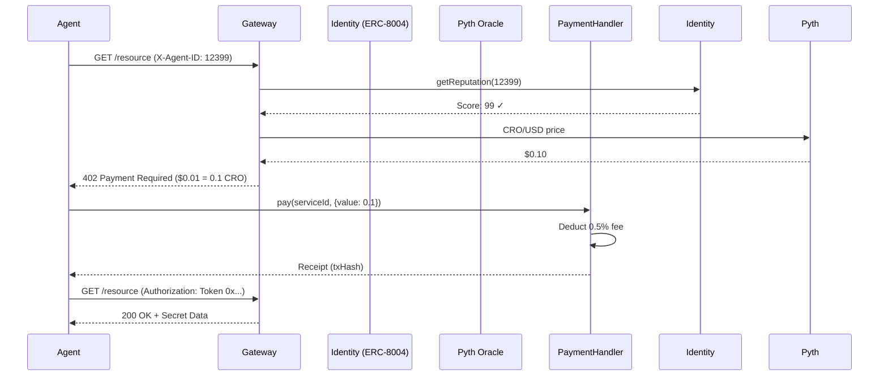

# 🚀 HighStation | Agent Payment Gateway

> **Trustless Payments Meet Agent Identity** - A production-ready API gateway enabling secure, low-cost agent-to-agent payments on Cronos zkEVM using X402 protocol.

[](https://zkevm.cronos.org)
[](https://opensource.org/licenses/MIT)
[](docs/audit/EXECUTIVE_SUMMARY.md)
[](docs/audit/RED_TEAM_REPORT.md)
[](docs/PROJECT_HISTORY.md)


## 📖 Overview

HighStation is a **next-generation API gateway** designed for the **autonomous agent economy**. It combines:

- **ERC-8004 Identity Verification** - On-chain reputation ensures only trusted agents access resources
- **Dynamic Pricing via Pyth Oracle** - Real-time CRO/USD price feeds for fair, transparent payments
- **0.5% Protocol Fee Model** - Sustainable revenue stream split via `PaymentHandler` smart contract
- **HTTP 402 Payment Protocol** - Native web standard for machine-to-machine payments
- **Cronos zkEVM** - Ultra-low gas fees (~$0.001/tx) for micro-transactions

## 🎯 The Problem

As AI agents proliferate, they need:
1. **Trust** - How do I know this agent is legitimate?
2. **Payment** - How do I pay for API access seamlessly?
3. **Cost** - Micro-payments must be economical ($0.01 target)

Traditional solutions fail:
- OAuth requires human intervention
- Credit cards have $0.30+ fees
- Centralized systems lack transparency

## ✨ Our Solution


```mermaid
sequenceDiagram
    participant Agent
    participant Gateway
    participant Identity (ERC-8004)
    participant Pyth Oracle
    participant PaymentHandler

    Agent->>Gateway: GET /resource (X-Agent-ID: 12399)
    Gateway->>Identity: getReputation(12399)
    Identity-->>Gateway: Score: 99 ✓
    Gateway->>Pyth: CRO/USD price
    Pyth-->>Gateway: $0.10
    Gateway-->>Agent: 402 Payment Required ($0.01 = 0.1 CRO)
    Agent->>PaymentHandler: pay(serviceId, {value: 0.1})
    PaymentHandler->>PaymentHandler: Deduct 0.5% fee
    PaymentHandler-->>Agent: Receipt (txHash)
    Agent->>Gateway: GET /resource (Authorization: Token 0x...)
    Gateway-->>Agent: 200 OK + Secret Data
```

## 🏗️ Architecture

### Smart Contracts
- **MockERC-8004** (`0xf79...f23`) - On-chain reputation registry
- **PaymentHandler** (`0xcb5...1dc`) - Fee splitting logic (0.5% to admin)

### Backend Services
- **IdentityService** - Validates agent reputation (threshold: 70/100)
- **PriceService** - Fetches real-time CRO/USD from Pyth Hermes API
- **PaymentMiddleware** - Enforces HTTP 402 protocol with dynamic pricing
- **SQLite Logging** - Persistent request/payment tracking

### Frontend Dashboard
- **React + Vite** - Real-time analytics at `localhost:5174`
- **Auto-refresh** - Updates every 5 seconds
- **Metrics**: Total requests, revenue, live agent activity

## 📚 Documentation

- **Guides**:
  - [🚀 Deployment Guide](docs/guides/DEPLOYMENT.md) - **Vercel + Supabase**
  - [🚀 배포 가이드 (한국어)](docs/guides/DEPLOYMENT_KR.md) - **Vercel + Supabase**
  - [Korean Quick Start (한국어 가이드)](docs/guides/README_KR.md)
  - [Local Testing Guide](docs/guides/LOCAL_TESTING.md)
  - [Demo Script](docs/guides/DEMO_SCRIPT.md)
  - [Production Checklist](docs/guides/PRODUCTION_CHECKLIST.md)

- **Security & Audits**:
  - [🛡️ Executive Summary](docs/audit/EXECUTIVE_SUMMARY.md) - **NEW v2.0.3**
  - [🚨 Red Team Report](docs/audit/RED_TEAM_REPORT.md) - Vulnerability findings
  - [✅ Security Fixes](docs/audit/SECURITY_FIXES.md) - Fix implementation details
  - [📋 Deployment Checklist](docs/audit/DEPLOYMENT_CHECKLIST.md) - Production readiness
  - [Professional Audit Report](docs/audit/PROFESSIONAL_AUDIT.md)
  - [Smart Contract Audit](docs/audit/SMART_CONTRACT_AUDIT_V2.md)
  - [Project History & Changelog](docs/PROJECT_HISTORY.md)

## 🚀 Quick Start

### Prerequisites
- Node.js 18+
- Foundry
- Cronos zkEVM Testnet funds ([Faucet](https://cronos.org/faucet))

### Installation
```bash
git clone https://github.com/yourname/highstation
cd highstation
npm install
forge install
```

### Configuration
Create `.env`:
```env
PRIVATE_KEY=0x...
RPC_URL=https://testnet.zkevm.cronos.org
CHAIN_ID=240
ADMIN_WALLET_ADDRESS=0x...
PYTH_PRICE_FEED_ID=0xff61491a131119af66174c751631553554319142416d44692a7556e17be2139a
```

### Deploy Contracts
```bash
forge build
npm run deploy:cronos
```

### Start Backend
```bash
npm run start
```

### Start Dashboard
```bash
cd dashboard
npm run dev
```

### Run Verification
```bash
npm run verify:cronos
```

**Expected Output:**
```
>>> REAL WORLD SIMULATION (Public Cronos zkEVM) <<<
SUCCESS: 402 Recv. Header: Token realm="X402", amount="97230562443800720", asset="CRO"
Payment Tx Sent: 0x0ce...eb6
SUCCESS: 200 OK
```

## 📊 Live Demo

**Deployed Contracts (Cronos zkEVM Testnet):**
- Identity: `0xf793549b33b121125e06e0578455c9fe84cc8f23`
- Payment Handler: `0xcb54c99e0025ce8a2f407a7e6f4ecf01ced141dc`

**Example Transaction:**
[View on Explorer](https://explorer.zkevm.cronos.org/tx/0x0ce46d564c1cea58e000c9f3f4f24e7145dbc5b84aeb187889516f6b8768eeb6)

## 💡 Business Model

### Revenue Streams
1. **Protocol Fee**: 0.5% of all payments
2. **Premium Tiers**: Higher reputation = Lower fees
3. **SaaS Dashboard**: White-label for enterprises

### Unit Economics
- **Average Payment**: $0.01
- **Protocol Fee**: $0.00005
- **Target Volume**: 1M requests/month
- **Monthly Revenue**: $50

### Competitive Advantage
| Feature | HighStation | Traditional API Keys | OAuth |
|---------|----------------|---------------------|-------|
| **Agent-Native** | ✅ | ❌ | ❌ |
| **On-Chain Trust** | ✅ | ❌ | ❌ |
| **Micro-Payment** | ✅ ($0.001 gas) | ❌ ($0.30 fee) | N/A |
| **Transparent** | ✅ | ❌ | ❌ |

## 🛠️ Technical Stack

- **Blockchain**: Cronos zkEVM (240 ChainID)
- **Oracle**: Pyth Network
- **Backend**: Node.js + TypeScript + Express
- **Frontend**: React + Vite + TailwindCSS
- **Smart Contracts**: Solidity + Foundry
- **Database**: SQLite

## 🔬 Future Roadmap

- [ ] **Account Abstraction**: ERC-4337 integration for gasless UX
- [ ] **Multi-Chain**: Polygon, Arbitrum, Base support
- [ ] **Advanced Identity**: Proof-of-Personhood, ZK-proofs
- [ ] **Reputation Marketplace**: Trade/stake reputation NFTs
- [ ] **GraphQL API**: Developer-friendly querying

## 📜 License

MIT - See [LICENSE](./LICENSE)

## 🤝 Contributing

PRs welcome! See [CONTRIBUTING.md](./CONTRIBUTING.md)

## 🙏 Acknowledgments

Built with ❤️ for the Cronos zkEVM Hackathon

- Cronos Labs for zkEVM infrastructure
- Pyth Network for reliable price feeds
- ERC-8004 standard authors

---

**[Live Dashboard](http://localhost:5174)** | **[API Docs](./docs/API.md)** | **[Demo Video](./DEMO.md)**
